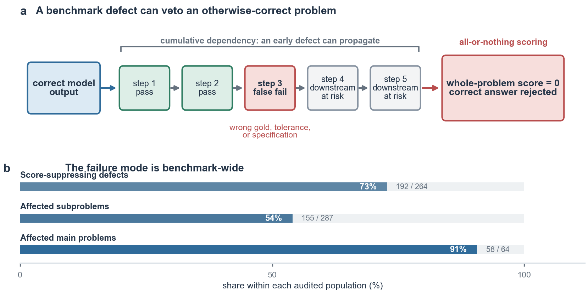
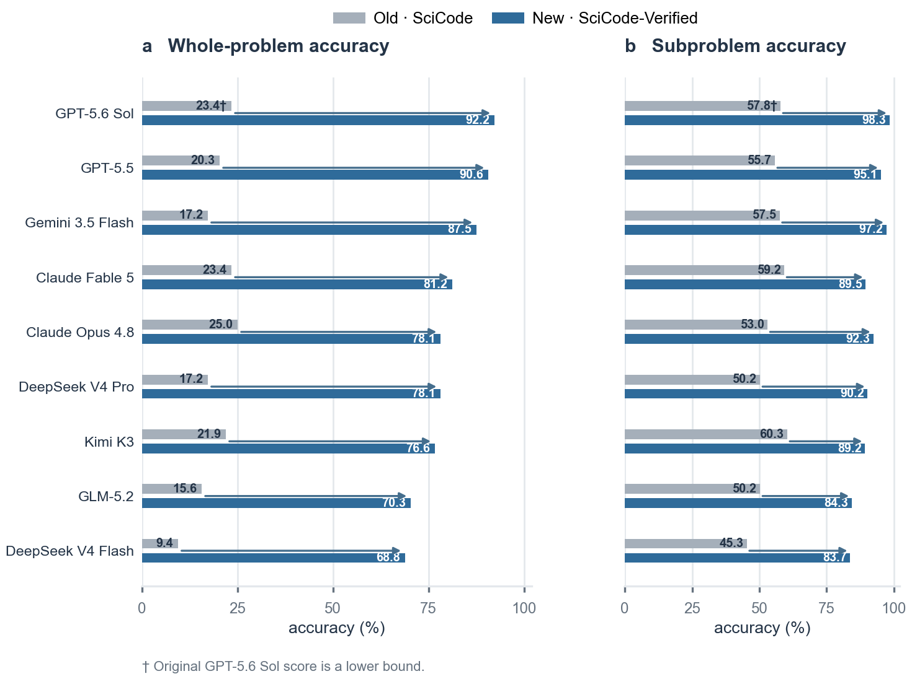

<div align="center">

# SciCode-Verified

**A human-verified benchmark for scientific code generation**

[Paper](https://arxiv.org/abs/2608.04975) ·
[Dataset](https://huggingface.co/datasets/shhu2001/SciCode-Verified) ·
[GitHub data release](https://github.com/flyingwagner/scicode-verified/releases/tag/data) ·
[Run the benchmark](#run-it) ·
[Evaluation protocol](#evaluation-protocol) ·
[Audit trail](CLEANING_LOG.md) ·
[Upstream SciCode](https://github.com/scicode-bench/SciCode)

[](https://arxiv.org/abs/2608.04975)
[](https://huggingface.co/datasets/shhu2001/SciCode-Verified)
[](https://github.com/flyingwagner/scicode-verified/releases/tag/data)
[](scicode_verified/problems_test.jsonl)
[](scicode_verified/manifest.json)
[](eval_clean/vendor/LICENSE)

</div>

## News

- **August 2026:** The [SciCode-Verified paper](https://arxiv.org/abs/2608.04975) is now on arXiv,
  and the versioned `v2` benchmark data is available on
  [Hugging Face](https://huggingface.co/datasets/shhu2001/SciCode-Verified).

SciCode-Verified is an independent, human-in-the-loop correction of the
[SciCode](https://github.com/scicode-bench/SciCode) test benchmark. It preserves the scientific
reasoning challenge while repairing contradictions, missing conventions, incorrect frozen
targets, non-deterministic tests, and other defects that can reject valid solutions.

<table>
  <tr>
    <td align="center"><strong>262</strong><br>verified corrections</td>
    <td align="center"><strong>63 / 64</strong><br>problems changed</td>
    <td align="center"><strong>192 / 262</strong><br>defects that reject correct code</td>
    <td align="center"><strong>155 / 287</strong><br>affected subproblems</td>
  </tr>
</table>

## How one defect becomes a benchmark-wide failure



SciCode subproblems are cumulative, and a whole problem passes only when every scored
subproblem passes. One defective specification, frozen answer, or test can therefore propagate
downstream and erase an otherwise correct solution. The audit found this score-suppressing
failure mode in **58 of 64 main problems**.

## Matched re-evaluation



In the manuscript's matched twelve-model-snapshot evaluation, changing only the benchmark data moves the
observed frontier from **45.3–60.3% to 83.7–98.3%** on subproblems, and from
**9.4–26.6% to 68.8–92.2%** on whole problems. The model output protocol, evaluation harness,
with-background condition, pass@1 setting, and multi-environment-OR grading are held fixed.

> SciCode-Verified is not an easier rewrite. Corrections state what is required to make each
> task well posed and its grading faithful. Weak tests are tightened; the scientific
> derivations and algorithms remain the model's responsibility.

## Reproducible by construction

Every accepted correction is recorded in a ledger, propagated from a single source of truth,
and checked against the released JSONL, HDF5, and manifest. See
[`CLEANING_LOG.md`](CLEANING_LOG.md) for the complete audit and
[`analysis/README.md`](analysis/README.md) for release statistics.

## Run it

Clone the repository and install the small runtime:

```bash
git clone https://github.com/flyingwagner/scicode-verified.git
cd scicode-verified
python3 -m venv .venv
source .venv/bin/activate
python -m pip install -U pip openai h5py numpy scipy matplotlib sympy
```

Download the released grading targets from Hugging Face and verify their checksum:

```bash
hf download shhu2001/SciCode-Verified test_data_cleaned.h5 \
  --repo-type dataset \
  --local-dir scicode_verified
md5sum scicode_verified/test_data_cleaned.h5
# 2b41a7df40ddc23ce651ec05b8ecb6f8
```

The same file is mirrored in GitHub Releases:

```bash
gh release download data --repo flyingwagner/scicode-verified --dir scicode_verified
md5sum scicode_verified/test_data_cleaned.h5
# 2b41a7df40ddc23ce651ec05b8ecb6f8
```

Run a one-problem smoke test:

```bash
export DEEPSEEK_API_KEY="..."
python eval_clean/run_deepseek_eval.py \
  --model pro \
  --dataset cleaned \
  --background on \
  --run smoke \
  --only 58 \
  --workers 1
```

Runs are resumable. Generated code, raw responses, per-step scores, and aggregate results are
saved under `eval_clean/ds_runs/`. OpenRouter models work with the same entry point by setting
`OPENROUTER_API_KEY` and passing the raw model slug to `--model`.

For generation-only runs, cached re-grading, provider configuration, and original-versus-
verified comparisons, see [`eval_clean/README.md`](eval_clean/README.md).

### Run with Inspect

The [Inspect wrapper](scicode_inspect.py) uses the same cumulative prompts, code extraction, reference steps, and corrected targets as the existing runner. Install its dependency in your environment:

```bash
python -m pip install -r requirements-inspect.txt
```

Download `scicode_verified/test_data_cleaned.h5` as described above, start Docker, and run from this repository root:

```bash
inspect eval scicode_inspect.py --model openai/gpt-5.5 \
  --sample-id 58 --log-dir logs/inspect-smoke
```

Omit `--sample-id 58` to run all 64 problems. Inspect handles provider credentials, model settings, concurrency, and `.eval` logs. Its first scoring run builds a Docker image containing two scientific Python environments. Generated code runs inside the container, with networking disabled. Each scored step passes if it passes in either environment; a main problem passes only if every scored step passes. Logs report `problem_accuracy` and `subproblem_accuracy` as fractions between 0 and 1 and retain the generated step code and per-environment grading details.

The task defaults to providing scientific background. Run the other condition separately:

```bash
inspect eval scicode_inspect.py --model openai/gpt-5.5 \
  -T provide_scientific_background=false
```

| Task parameter | Default | Meaning |
|---|---|---|
| `provide_scientific_background` | `true` | Include the expert-written background. |
| `timeout` | `1800` | Execution timeout per step and environment in seconds. |
| `grading_environments` | `both` | Use `both`, `2024`, or `2025`. |
| `full_envs` | `false` | Continue grading after the first passing environment. |
| `targets_path` | `scicode_verified/test_data_cleaned.h5` | Override the local HDF5 path; the manifest checksum is still required. |
| `generate_only` | `false` | Generate without the HDF5 or Docker. |
| `download_targets` | `false` | Download missing targets from a pinned Hugging Face revision into `~/.cache/scicode_verified`, with SHA256 and manifest verification. |

Generate first and score the saved Inspect log later. This path requires the corrected targets and Docker during generation so that the log retains the target file and sandbox configuration:

```bash
inspect eval scicode_inspect.py --model openai/gpt-5.5 \
  --no-score --log-dir logs/inspect-generation
inspect score logs/inspect-generation/<run>.eval
```

Use the `--no-score` path for deferred grading. The `generate_only` option is useful when targets and Docker are unavailable; its logs retain code for custom re-scoring, but do not contain target-file or sandbox setup.

The Docker environments pin NumPy/SciPy to `1.26.4`/`1.13.1` and `2.4.2`/`1.17.1`. Both include matplotlib, h5py, and sympy. These environments implement the two-version OR protocol but do not reproduce every package or installation omission in the paper's historical machines.

### Run on Hawk

[`hawk.yaml`](hawk.yaml) configures one main-problem sample (`limit: 1`), one epoch, the `openai/gpt-6-luna` model, and grading in both environments. The first sample is problem 5, which includes several model calls, one per scored subproblem. The runner downloads and verifies the corrected targets automatically. No checkpointing is enabled.

Hawk installs the task from Git. Publish the `inspect-wrapper` branch containing these changes before launching, then replace the branch ref in `tasks[0].package` with that published commit SHA to pin the run. The repository now includes package metadata and an Inspect entry point for this installation.

With Hawk 3.x configured and authenticated for your deployment:

```bash
hawk eval-set run hawk.yaml
```

This uses Hawk's managed model proxy. Availability of `gpt-6-luna` depends on your deployment. The config was validated with Hawk 3.6.0; no cluster run was submitted.

## Evaluation protocol

| | Canonical setting |
|---|---|
| Evaluation set | 64 main problems / 287 scored subproblems |
| Sampling | pass@1 |
| Whole-problem score | Pass only if every scored subproblem passes |
| Context | With and without background reported separately |
| Step construction | Cumulative: step *k* receives code from steps `1..k-1` |
| Timeout | 1,800 seconds per step and environment |
| Environment drift | Pass if correct in either pinned 2024-era or 2025-era scientific Python |
| Integrity | Dataset hashes must match `scicode_verified/manifest.json` |

The release excludes original test problem 2 because its specification does not determine a
unique, verifiable answer. The remaining 64 problems are the exact matched set used in the
before/after evaluation above.

## Repository map

| Path | What it contains |
|---|---|
| [`scicode_verified/`](scicode_verified/) | Released benchmark, source problems, target patches, and manifest |
| [`eval_clean/`](eval_clean/) | Portable generation, scoring, and re-grading harness |
| [`analysis/`](analysis/) | Machine-readable defect and evaluation analyses |
| [`ledger/`](ledger/) | Per-change provenance and focused defect investigations |
| [`tools/`](tools/) | Dataset assembly and release verification gate |

The large `test_data_cleaned.h5` is distributed through the
[Hugging Face dataset](https://huggingface.co/datasets/shhu2001/SciCode-Verified) and mirrored in
[GitHub Releases](https://github.com/flyingwagner/scicode-verified/releases/tag/data), not Git.
The evaluator verifies its hash before running.

## Attribution

SciCode-Verified is derived from SciCode and redistributed under the Apache License 2.0. The
vendored upstream notice and license are in [`eval_clean/vendor/`](eval_clean/vendor/). If you
use this release, please cite both the original SciCode benchmark and SciCode-Verified.

```bibtex
@article{hu2026scicodeverified,
  title         = {{SciCode-Verified}: How Benchmark Defects Underestimated the Scientific-Coding Ability of Language Models},
  author        = {Hu, Sihan and Huang, Lyuhan and Deng, Youjin and Chen, Kun},
  year          = {2026},
  eprint        = {2608.04975},
  archivePrefix = {arXiv},
  primaryClass  = {cs.SE},
  url           = {https://arxiv.org/abs/2608.04975}
}
```
